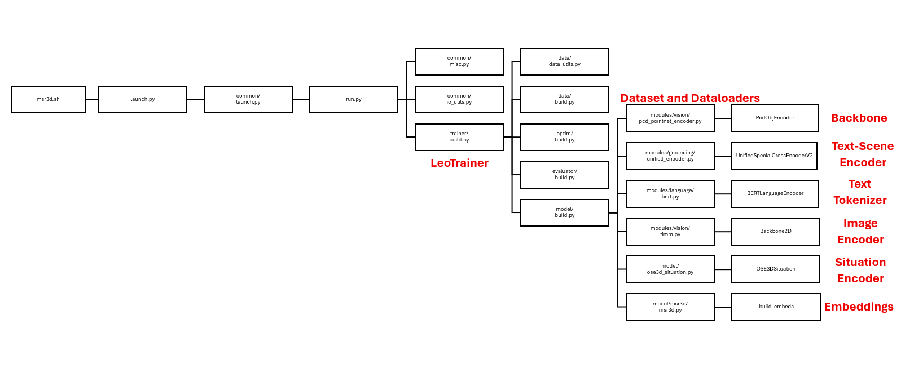

# Msqa_Thesis_2025
## Introduction
 This thesis proposes a hybrid approach that merges multi-modal object grounding with situation-aware 3D semantic segmentation. We aim to build a system that can interpret natural language queries and visual references to identify and segment objects in a 3D scene, enhanced by an understanding of the user's spatial situation.
## Models Used
### MSR3D
#### Diagram

#### Backbone
**PcdObjEncoder Class**
 a PyTorch neural network module that encodes 3D point cloud objects into feature embeddings using PointNet++ architecture. This encoder is specifically designed for processing multiple objects in batch format and is registered in the MSR3D vision registry.
 Object Embedding Size: (3,10,768)
 1. Converts 3D point cloud data into high-dimensional feature representations
  - Feature Vector 768 (from configuration file)
 2. Provides object semantic classification logits for 607 different classes(using utils.py/get_mlp_head)
 #### Text-Scene Encoder-Multi Modal Fusion
 **UnifiedSpatialCrossEncoderV2**
 The UnifiedSpatialCrossEncoderV2 is a multimodal fusion module. It combines text embeddings and object embeddings into a shared representation through a Transformer-based encoder.

 Returns text embeddings enriched with object context and object embeddings enriched with text context
#### Text Tokenizer
**BERTLanguageEncoder**
The BERTLanguageEncoder wraps a Hugging Face pretrained BertModel to provide text token embeddings for downstream multimodal tasks. 
Text Embedding Size: (3,10,768) 
#### Image Encoder - 2D Backbone
Backbone2D is a thin wrapper around a 2D visual backbone with optional global pooling to produce a fixed-size feature vector for images. Supported pooling modes include adaptive average pooling, convolution-based reduction, or a lightweight attention mechanism.
(Can also use BLIP2 Model from huggin Face)
#### Situation Encoder
The OSE3DSituation module is a core component in MSR3D for modeling objects in a 3D scene under a specific “situation” or context. Its purpose is to take object-level features (from point clouds or semantic encoders), enrich them with additional information (location, size, orientation, type). Depending on configuration, the module can apply different forms of situation modeling: adding location/size embeddings, injecting an anchor’s orientation and position, transforming objects into the agent’s coordinate system, or applying cross-attention/DiT-style attention between objects and the situation embedding.
#### Data Diagram for MSR3D
##### MSR3D_v2_pcds
###### Scannet-Base
1. annotations
   - splits
      Contains train/test/val splits in txt files and json files with the order of the test/val split scenes
   - meta-data
      - scannetv2_raw_categories.json
      - scannetv2-labels.compined.tsv
      Resolved: Found from a github repository 
   - refer - **Missing**
      - scanrefer.jsonl
      - ssg_ref_.json
      - ssg_caption_.json
   - qa - **Missing**
      - ScanQA_v1.0_train.json
      - ScanQA_v1.0_val.json
   - sqa task - **Missing**
      - answer_dict.json
      - balanced
         - v1_balanced_sqa_annotations_scannetv2.json
         - v1_balanced_sqa_questions_scannetv2.json
2. scan_data
   - instance_id_to_label

   - pcd_with_global_alignment
      - pcd_with_global_alignment
         Contains the .pth files with the scenes pointclouds. Point's (X, Y, Z) (no RGB).
      - instance_id_to_label
         - Contains the id of each object in each scene and its label in the form 
            - Key 0: type=<class 'str'>
            preview: window
            - Key 1: type=<class 'str'>
            preview: window
            - Key 2: type=<class 'str'>
            preview: table
   - instance_id_to_name - **Missing**
      - Contains json files
   - instance_id_to_loc - **Missing**
      - Contains npy files  
   - instance_id_to_gmm_color - **Missing**
      - Contains json files
##### obj_imgs
###### ScanNet
   1. scannet
      - Contains the images of each object for each scene
##### text_annotations
   1. msnn
      - scannet
         - msnn_scannet.json
   2. msqa
      - scannet
         - msqa_scannet_test_wo_answers.json
         - msqa_scannet_test.json
         - msqa_scannet_train.json
         - msqa_scannet_val.json