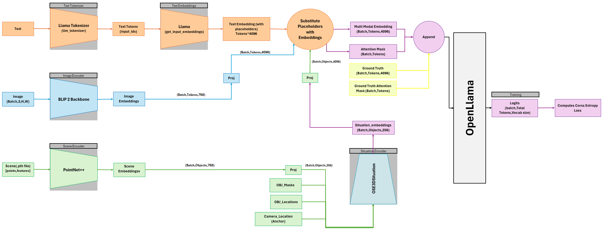

# Msqa_Thesis_2025
## Introduction
 This thesis proposes a hybrid approach that merges multi-modal object grounding with situation-aware 3D semantic segmentation. We aim to build a system that can interpret natural language queries and visual references to identify and segment objects in a 3D scene, enhanced by an understanding of the user's spatial situation.

## Installation

### Prerequisites
- Conda
- Git

### Steps
1. Clone the repository:
    ```shell
    git clone https://github.com/PanagiotisDemetriou/Msqa_Thesis_2025.git
    cd Msqa_Thesis_2025
    ```

2. Create conda environment from scratch:

    ```shell
    # Create conda environment
    conda create -n ptv3 python=3.10 -y
    conda activate ptv3

    # Download cuda 12.1
    export NVIDIA_DRIVER_FILE=cuda_12.1.0_530.30.02_linux.run
    wget https://developer.download.nvidia.com/compute/cuda/12.1.0/local_installers/${NVIDIA_DRIVER_FILE}
   
    # Locally install cuda 12.1
    export LUSTRE_CUDA_PATH=/lustreFS/data/vcg/pdemteriou
    export CUDA_VER=12.1
    bash ${NVIDIA_DRIVER_FILE} --silent --override --toolkit --toolkitpath=${LUSTRE_CUDA_PATH}/cuda-${CUDA_VER}
    unset LUSTRE_CUDA_PATH
      
    # Create activate.sh and add the following bash commands
    mkdir -p $CONDA_PREFIX/etc/conda/activate.d
    echo '#!/bin/sh
    export LUSTRE_CUDA_PATH=/lustreFS/data/vcg/pdemteriou
    export INIT_CUDADIR=$CUDADIR
    export INIT_PATH=$PATH
    export INIT_NUMBAPRO_NVVM=$NUMBAPRO_NVVM
    export INIT_NUMBAPRO_LIBDEVICE=$NUMBAPRO_LIBDEVICE
    export INIT_NVCCDIR=$NVCCDIR
    export INIT_LD_LIBRARY_PATH=$LD_LIBRARY_PATH
    export INIT_CPATH=$CPATH
    export INIT_CUDA_HOME=$CUDA_HOME
    export INIT_CUDA_BIN_PATH=$CUDA_BIN_PATH
    cuda=cuda-12.1
    export CUDADIR=$LUSTRE_CUDA_PATH/$cuda
    export PATH=$CUDADIR/bin:$PATH
    export NUMBAPRO_NVVM=$CUDADIR/nvvm/lib64/libnvvm.so
    export NUMBAPRO_LIBDEVICE=$CUDADIR/nvvm/libdevice/
    export NVCCDIR=$CUDADIR/bin/nvcc
    export LD_LIBRARY_PATH=$CUDADIR/lib64:$LD_LIBRARY_PATH
    export CPATH=$CUDADIR/include:$CPATH
    export CUDA_HOME=$CUDADIR
    export CUDA_BIN_PATH=$CUDADIR' > $CONDA_PREFIX/etc/conda/activate.d/activate.sh

    # Verify cuda installation
    conda deactivate
    conda activate ptv3
    nvcc --version

    # Clean cuda installation files
    rm -v ${NVIDIA_DRIVER_FILE}
    unset NVIDIA_DRIVER_FILE

    # Create deactivate.sh and add the following commands
    mkdir -p $CONDA_PREFIX/etc/conda/deactivate.d
    echo '#!/bin/sh
    export CUDADIR=$INIT_CUDADIR
    export PATH=$INIT_PATH
    export NUMBAPRO_NVVM=$INIT_NUMBAPRO_NVVM
    export NUMBAPRO_LIBDEVICE=$INIT_NUMBAPRO_LIBDEVICE
    export NVCCDIR=$INIT_NVCCDIR
    export LD_LIBRARY_PATH=$INIT_LD_LIBRARY_PATH
    export CPATH=$INIT_CPATH
    export CUDA_HOME=$INIT_CUDA_HOME
    export CUDA_BIN_PATH=$INIT_CUDA_BIN_PATH
    unset cuda
    unset INIT_CUDADIR
    unset INIT_PATH
    unset INIT_NUMBAPRO_NVVM
    unset INIT_NUMBAPRO_LIBDEVICE
    unset INIT_NVCCDIR
    unset INIT_LD_LIBRARY_PATH
    unset INIT_CPATH
    unset INIT_CUDA_HOME
    unset INIT_CUDA_BIN_PATH
    unset LUSTRE_CUDA_PATH' > $CONDA_PREFIX/etc/conda/deactivate.d/deactivate.sh
   
    # Install cudnn (Prometheus cluster)
    pip install gdown
    gdown 1U8b_ecKwQOpJZiXMtBo9swpu7_Npp0Zi
    tar -xvf cudnn-linux-x86_64-8.9.2.26_cuda12-archive.tar.xz
    cp -v cudnn-*-archive/include/cudnn*.h $LUSTRE_CUDA_PATH/cuda-${CUDA_VER}/include 
    cp -Pv cudnn-*-archive/lib/libcudnn* $LUSTRE_CUDA_PATH/cuda-${CUDA_VER}/lib64 
    chmod a+r $LUSTRE_CUDA_PATH/cuda-${CUDA_VER}/include/cudnn*.h $LUSTRE_CUDA_PATH/cuda-${CUDA_VER}/lib64/libcudnn*
   
    # Clean cudnn installation files
    rm -v cudnn-linux-x86_64-8.9.2.26_cuda12-archive.tar.xz
    rm -rv cudnn-linux-x86_64-8.9.2.26_cuda12-archive/
    unset CUDA_VER
   
    # Install ninja
    conda install ninja
   
    # Install pytorch
    pip install torch==2.5.1 torchvision==0.20.1 torchaudio==2.5.1 --index-url https://download.pytorch.org/whl/cu121
    pip install "numpy<2.0"
   
    # Verify pytorch installation
    srun -c 1 --gres=gpu:1 python -c "import torch; print(f'{torch.cuda.is_available()=}'); x = torch.rand(5, 3); x = x.cuda(); print(f'{x.device}')"
   
    # install pytorch_geometric (see https://pytorch-geometric.readthedocs.io/en/latest/install/installation.html)
    pip install pyg_lib torch_scatter torch_sparse torch_cluster -f https://data.pyg.org/whl/torch-2.5.1+cu121.html
    pip install torch_geometric

    pip install -r requirements.txt
   
    cd Pointcept_main/libs/pointops
    srun -c 6 --mem=144G --gres=gpu:1 --pty /bin/bash
    conda activate ptv3
    python setup.py install
    exit
    cd ../../..
    ```
   
## Models Used
### MSR3D
#### Diagram


#### Backbone
**PcdObjEncoder Class**
 a PyTorch neural network module that encodes 3D point cloud objects into feature embeddings using PointNet++ architecture. This encoder is specifically designed for processing multiple objects in batch format and is registered in the MSR3D vision registry.
 Object Embedding Size: (3,10,768)
 1. Converts 3D point cloud data into high-dimensional feature representations
  - Feature Vector 768 (from configuration file)
 2. Provides object semantic classification logits for 607 different classes(using utils.py/get_mlp_head)
 #### Text-Scene Encoder-Multi Modal Fusion
 **UnifiedSpatialCrossEncoderV2**
 The UnifiedSpatialCrossEncoderV2 is a multimodal fusion module. It combines text embeddings and object embeddings into a shared representation through a Transformer-based encoder.

 Returns text embeddings enriched with object context and object embeddings enriched with text context
#### Text Tokenizer
**BERTLanguageEncoder**
The BERTLanguageEncoder wraps a Hugging Face pretrained BertModel to provide text token embeddings for downstream multimodal tasks. 
Text Embedding Size: (3,10,768) 
#### Image Encoder - 2D Backbone
Backbone2D is a thin wrapper around a 2D visual backbone with optional global pooling to produce a fixed-size feature vector for images. Supported pooling modes include adaptive average pooling, convolution-based reduction, or a lightweight attention mechanism.
(Can also use BLIP2 Model from huggin Face)
#### Situation Encoder
The OSE3DSituation module is a core component in MSR3D for modeling objects in a 3D scene under a specific “situation” or context. Its purpose is to take object-level features (from point clouds or semantic encoders), enrich them with additional information (location, size, orientation, type). Depending on configuration, the module can apply different forms of situation modeling: adding location/size embeddings, injecting an anchor’s orientation and position, transforming objects into the agent’s coordinate system, or applying cross-attention/DiT-style attention between objects and the situation embedding.
#### Data Diagram for MSR3D
##### MSR3D_v2_pcds
###### Scannet-Base
1. annotations
   - splits
      Contains train/test/val splits in txt files and json files with the order of the test/val split scenes
   - meta-data
      - scannetv2_raw_categories.json
      - scannetv2-labels.compined.tsv
      Resolved: Found from a github repository 
   - refer - **Missing**
      - scanrefer.jsonl
      - ssg_ref_.json
      - ssg_caption_.json
   - qa - (from: https://huggingface.co/datasets/huangjy-pku/LEO_data/blob/main/annotations.zip)
      - ScanQA_v1.0_train.json
      - ScanQA_v1.0_val.json
   - sqa_task 
      - answer_dict.json (from: https://zenodo.org/records/7792397)
      - balanced (from: https://huggingface.co/datasets/huangjy-pku/LEO_data/blob/main/annotations.zip)
         - v1_balanced_sqa_annotations_scannetv2.json
         - v1_balanced_sqa_questions_scannetv2.json
2. scan_data
   - instance_id_to_label

   - pcd_with_global_alignment
      - pcd_with_global_alignment
         Contains the .pth files with the scenes pointclouds. Point's (X, Y, Z) (no RGB).
      - instance_id_to_label
         - Contains the id of each object in each scene and its label in the form 
            - Key 0: type=<class 'str'>
            preview: window
            - Key 1: type=<class 'str'>
            preview: window
            - Key 2: type=<class 'str'>
            preview: table
   - instance_id_to_name (from: https://github.com/cshizhe/vil3dref)
      - Contains json files
   - instance_id_to_loc (from: https://github.com/cshizhe/vil3dref)
      - Contains npy files  
   - instance_id_to_gmm_color (from: https://github.com/cshizhe/vil3dref)
      - Contains json files
##### obj_imgs
###### ScanNet
   1. scannet
      - Contains the images of each object for each scene
##### text_annotations
   1. msnn
      - scannet
         - msnn_scannet.json
   2. msqa
      - scannet
         - msqa_scannet_test_wo_answers.json
         - msqa_scannet_test.json
         - msqa_scannet_train.json
         - msqa_scannet_val.json